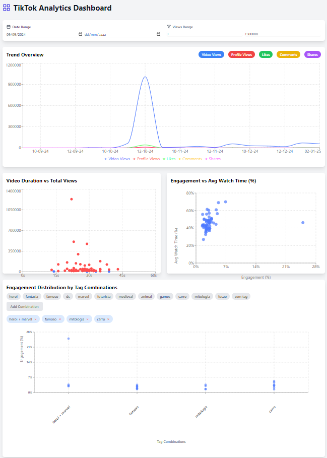
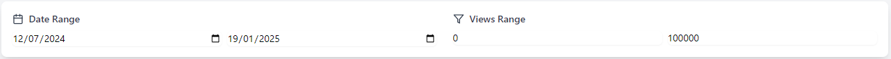
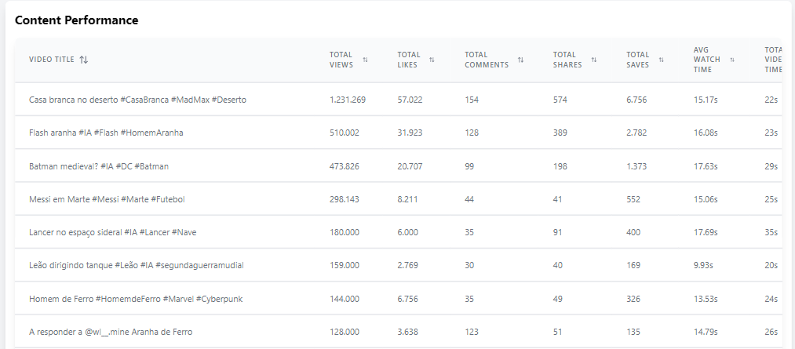

# Tiktok Dashboard

  

[Dashboard](https://tiktokdashboard.netlify.app)

    Sumário:
        1 - Definição do problema.
        2 - Definição do objetivo.
        3 - Coleta de dados.
        4 - Feature Engineering.
        5 - Ferramentas.
        6 - Dashboard.
        7 - Conclusão.
        8 - Melhorias.

###  1 - Definição do problema.

Atualmente, sou criador de conteúdo no Tiktok e tive a necessidade de saber quais os melhores modelos de vídeos focar para ter mais sucesso em meu perfil e aumentar o engajamento.

###  2 - Definição dos objetivos.

- Avaliar o desempenho geral do meu perfil.
- Identificar a relação entre a duração dos vídeos e o número de visualizações.
- Determinar se quanto maior o tempo que o usuário passa no vídeo, maior é o engajamento
- Analisar quais tipos de vídeos trazem mais engajamento e novos seguidores.

###  3 - Coleta de dados.

No Tiktok Studio, plataforma em que os criadores de conteúdo tem acesso, é possível baixar os dados do perfil do usuário em formato CSV. Porém, os dados são limitados e não possuem muitas informações. Desse modo, tive que coletar os dados de cada vídeo manualmente.
    
###  4 - Feature Engineering.

Uma métrica muito utilizada entre os criadores de conteúdo é o engajamento. O engajamento é a quantidade de interações que o vídeo recebeu. Para o Tiktok, o engajamento é medido pelo número de likes, comentários, compartilhamentos divido pelo número de visualizações. Assim, para cada vídeo, é possível calcular o engajamento e comparar com os outros vídeos independente do número de visualizações.
Além disso, eu criei 2 Tags diferentes para cada vídeo que representavam sobre qual era o tema do vídeo.
    
###  5 - Ferramentas.

Com o grande avanço das IA's, eu pude utilizar a plataforma Bolt.new para criar uma estrutura base para meu projeto usando JavaScript e Reactjs. Para fazer as alterações específicas que julguei necessárias, utilizei o Cursor.

###  6 - Dashboard.

Primeiramente, criei filtros globais no dashboard para controlar tanto o período de publicação dos vídeos quanto a quantidade de visualizações. Pois, existem períodos em que os vídeos tem mais visualizações e outros em que tem menos, além de poder comparar padrões de desempenho em vídeos com diferentes visualizações.

  

Gráfico 1:

  

Gráfico de linha que mostra o número de visualizações, likes, comentários, compartilhamentos e de pessoas que acesssaram meu perifl naquele dia em específico.

Gráfico 2:

  

Gráfico dotplot com o tempo do vídeo no eixo X e o número de views no eixo Y.

Gráfico 3:

  

Gráfico dotplot com o engajamento no eixo X e o proporção média assistida do vídeo no eixo Y.

Gráfico 4:

  

Gráfico dotplot com a combinação de tags no eixo X e engajamento no eixo Y.

Gráfico 5:

  

Gráfico de linhas e barras que combina categorias no eixo X, com a % média do tempo assistido no eixo Y à esquerda e o número de novos seguidores no eixo Y à direita.

Tabela:

  

Tabela com várias informações sobre os vídeos.

O deploy do dashboard foi realizado na plataforma Netlify, e está disponível através do seguinte link: [Dashboard](https://tiktokdashboard.netlify.app).

###  7 - Conclusão.

Com o dashboard, posso ter uma visão geral do desempenho das minhas postagens, podendo aproveitar momentos de picos de visualizações no meu perfil e aproveitar essas oportunidades para produzir os modelos de vídeos que geram maior engajamento.

###  8 - Melhorias.

- Implementar uma API para coletar os dados dos vídeos. (em produção)
- Adicionar novas variáveis para o dashboard.
- Adicionar mais filtros.
- Criar abas para melhor organização.
- Adicionar mais gráficos.

---
